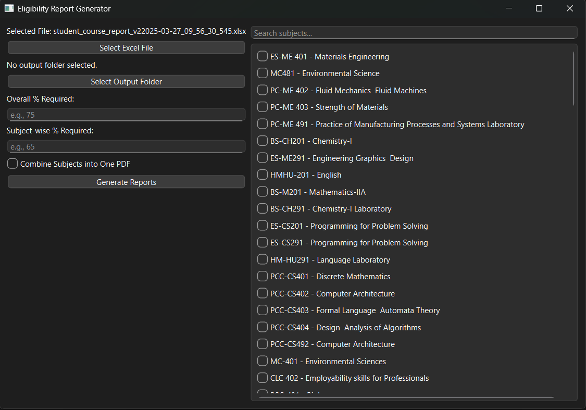
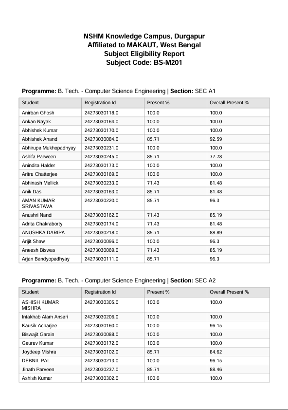

# 📊 Student Eligibility Report Generator

A modern and user-friendly desktop tool that processes Excel attendance data to generate subject-wise eligibility reports — with a beautiful GUI, PDF exports, search & filtering, and no need for Python installation!

**Screenshot**

**Sample Export File**

---

## ✨ Features

- ✅ Clean and modern graphical interface (no command-line!)
- ✅ Select multiple subjects using a searchable checklist
- ✅ Export subject-wise **eligibility PDFs**
- ✅ One-click Excel summary with dashboard & charts
- ✅ Built-in attendance rules (75% overall or subject-wise)
- ✅ Output folder selection
- ✅ Portable `.exe` file — no need to install Python!

---

## 📦 Download

Head to the [Releases](https://github.com/aurghya-0/Eligibility-Report-Creator/releases) section and download the latest `.exe` file:

👉 [Download the latest release](https://github.com/aurghya-0/Eligibility-Report-Creator/releases/latest)

> 💡 No installation needed. Just double-click the `.exe` and you're good to go!

---

## 🧑‍💻 How to Use

1. **Open the app** (`StudentEligibilityTool.exe`)
2. **Browse and select your Excel attendance file**
   - The file should contain columns like: `Student`, `Registration Id`, `Present %`, `Overall Present %`, `Course [Course Code]`, `Programme`, `Programme Section`
3. Wait for the subject list to appear
4. **Search and select** the subjects you want to export
5. Choose an output folder
6. Click **"Generate Report"**
7. Done! 🎉
   - PDFs and Excel file will be saved in your chosen folder
   - A progress bar will show the export progress

---

## 📂 Output

The tool creates:
- A clean `subjectwise_eligibility.xlsx` file with:
  - Dashboard with a chart of subject-wise eligibility
  - Individual sheets for each selected subject
- Individual PDFs with subject-wise student lists

---

## 🛠 Requirements

None! Just download the `.exe` — no Python or setup needed.

---

## 🧾 Sample Format for Input File

Make sure your Excel file includes the following columns:

| Student | Registration Id | Present % | Overall Present % | Course [Course Code] | Programme | Programme Section |
|---------|------------------|-----------|--------------------|-----------------------|-----------|--------------------|

---

## ❤️ Built With

- Python 3.11
- `tkinter` for GUI
- `pandas` for data processing
- `openpyxl` for Excel reports & charts
- `reportlab` for PDF generation
- `pyinstaller` to build standalone `.exe`

---

## 📃 License

This project is licensed under the MIT License.

---

### 🔗 Stay Connected

Follow the repository for updates and improvements. Contributions welcome!

